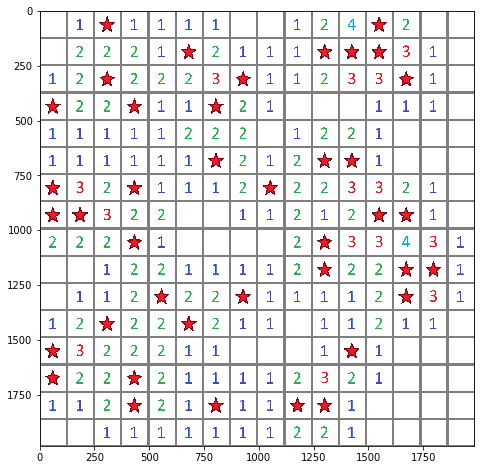
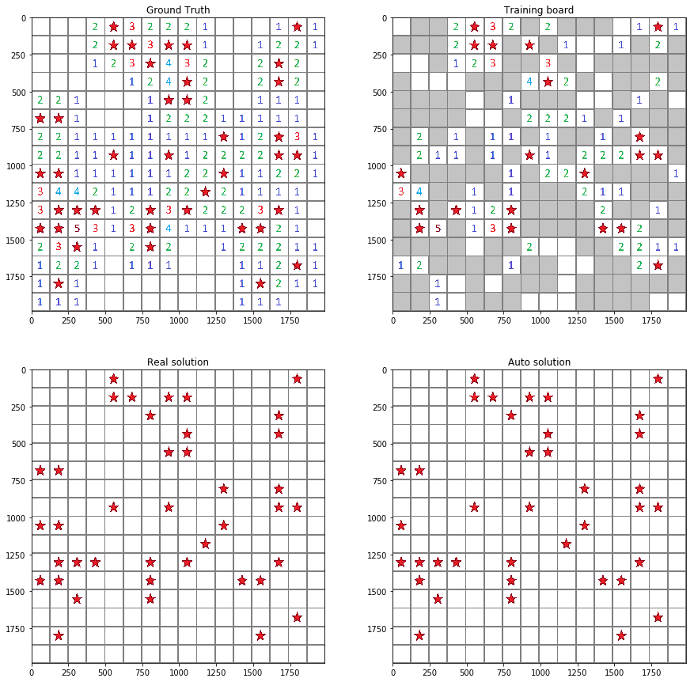
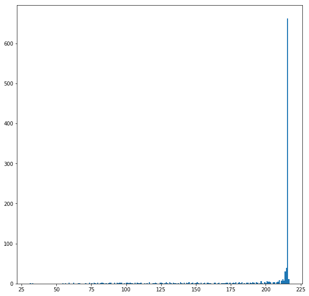

# Training a Convolutional Neural Network to solve minesweeper
## Description
I wanted to learn a bit of tensorflow, and also to solve the minesweeper problem. At first, (a year ago), I thought to use basic machine learning, but didn’t succeed because I barely knew how to do anything.
The idea was to train a network, that gets a partially open board and tries to predict where the mines are on the board.
We then use this network to look at the game-board and find the square with the least likelihood of being a mine. We then open it and predict once more on the updated game-board, and so on.

### Creating the board
In order to create the boards, we are given the size of the board (a square), and the number of mines. 
A function places the mines randomly, then runs over all squares and whenever there is a mine, it adds 1 to all 8 neighbours.

### An example of a board
Here we can see what a board looks like - the red stars are mines.

### Training the network
The network is a simple one consisting of 2D convolutional layers of varying depths and with 3x3 kernal sizes. And after that 2D transpose convolutional networks that bring the output back to the same size as the input.
### The layers used, and the training details:

    CNet.summary():
    _________________________________________________________________
    Layer (type)                 Output Shape              Param #   
    =================================================================
    conv1 (Conv2D)               (None, 14, 14, 32)        320       
    _________________________________________________________________
    conv2 (Conv2D)               (None, 12, 12, 64)        18496     
    _________________________________________________________________
    conv3 (Conv2D)               (None, 10, 10, 128)       73856     
    _________________________________________________________________
    deconv1 (Conv2DTranspose)    (None, 12, 12, 128)       147584    
    _________________________________________________________________
    deconv2 (Conv2DTranspose)    (None, 14, 14, 128)       147584    
    _________________________________________________________________
    deconv3 (Conv2DTranspose)    (None, 16, 16, 64)        73792     
    _________________________________________________________________
    dense1 (Dense)               (None, 16, 16, 1)         65        
    =================================================================
    Total params: 461,697
    Trainable params: 461,697
    Non-trainable params: 0
    
### Training details:
    _________________________________________________________________
    Train on 360000 samples, validate on 40000 samples
    Epoch 1/10
    sample - loss: 0.0630 - acc: 0.9140 - val_loss: 0.0510 - val_acc: 0.9308
    Epoch 2/10
    sample - loss: 0.0490 - acc: 0.9339 - val_loss: 0.0470 - val_acc: 0.9366
    Epoch 3/10
    sample - loss: 0.0459 - acc: 0.9384 - val_loss: 0.0451 - val_acc: 0.9397
    Epoch 4/10
    sample - loss: 0.0445 - acc: 0.9402 - val_loss: 0.0439 - val_acc: 0.9408
    Epoch 5/10
    3sample - loss: 0.0437 - acc: 0.9413 - val_loss: 0.0434 - val_acc: 0.9416
    Epoch 6/10
    sample - loss: 0.0431 - acc: 0.9420 - val_loss: 0.0429 - val_acc: 0.9422
    Epoch 7/10
    sample - loss: 0.0427 - acc: 0.9425 - val_loss: 0.0426 - val_acc: 0.9426
    Epoch 8/10
    sample - loss: 0.0424 - acc: 0.9429 - val_loss: 0.0424 - val_acc: 0.9428
    Epoch 9/10
    sample - loss: 0.0422 - acc: 0.9432 - val_loss: 0.0423 - val_acc: 0.9431
    Epoch 10/10
    sample - loss: 0.0420 - acc: 0.9434 - val_loss: 0.0421 - val_acc: 0.9433

### Example for a training board:

### Test statistics
Success rate:
    0.662

Histogram of games ended after n steps. Note that the majority are indeed solved:

## Work process:
During training, I played around with the network size, the number of board examples, and the number of epochs. All this brought to the success rate to around 50%. a larger size of network mostly overfitted the boards, or at the very least didn't improve the success-rate.
Looking at the network's solutions, I realized that it didn't open all the neighbours of the squares with 0 in them. This is because the network is a convloutional one, and therefore only sums up and multiplies the numbers. I wanted the 0's to pull the output down.
Finally, I hit upon the idea of changing the input. instead of simply 0-8 as the input (the number of neighboring mines), I used the following formula: *input = log10(neighbors+0.1)*. This simple transoformation raised the success-rate by approximately 15%. AS you can see in the example above, it doesn't always do it, but much more often than previously.

I also think that in this particular instance, the training didn't go that well. I got success-rates nearer to 70% in the past.
I also realize that you can describe the numbers as a 10x1 vector, and then the input is a tensor of size: 16x16x10, and works like an image with 10 colors. But this is more interesting and probably also demands a smaller network and less training.

## Why 66% is good enough for me:
Quite early on, I realised that the success rate of solving minesweeper can't possibly reach 100% because its a game where one has to make guesses a few times.

I looked for statistics on the winning of minesweeper games and arrived at [this place:](https://math.stackexchange.com/questions/42494/odds-of-winning-at-minesweeper-with-perfect-play).

Specifically, I found one who wrote a program that solves minesweeper, by writing all the rules for whether there is a mine in any square. He writes specifically that his program solves the intermediate level at a 69% success-rate, and therefore my goal was to get as near as possible to 70%.

### *Remarks on the statistics of minesweeper, copied from 'Mathematics stack exchange':*
> So I tried writing a program to play against minesweeper. I made a minesweeper game with the usual 9x9 with 10mines or 16x16 with 40 or 30x16 at 99mines and the rule that you can never lose on the first move (the mine is moved randomly if it should be hit on first move.)

>My play algorithm tries the following on each move, using the first success: 1. find easy no-mine spots (known mines=mine readouts) 2. Find spot pairs with 50% chance of a mines, make two copies of the screen, and set each copy (A or B) with the mine at one of the two location alternatives. The choice then forces other spots to be mines or not. Find all the other spots that are determined by the 50/50 selection. Branch on the three possibilities: a) position A or B cause there to be too many mines somewhere, meaning that one of the positions is impossible and the other is correct; or b) Both seem possible. On b) compare the two case results and look for spots that are open in both cases and return these as the play. This picks up things like 111 running in from an edge where the third 1 in cannot be a mine. 3. If b) occurs but there are no common open spots, search for the next 50%/50% pair and repeat 2. 4. If all 50%/50% spots fail to give a move, guess, selecting amongst the covered spots, initially requiring the chosen spots to be fully surrounded so the risk is mines/total spots in the sequence: a) corners b) edges c)rest of spots. If there are no fully surrounded spots: d) choose least likely to be a mine.

>Using this algorithm I get 89.9% wins for the beginner game and 69.0% for the intermediate game. All of the losses happen on guesses. For the expert game I only win 17.9% of games.

>The distribution of guesses (after the first move) for the intermediate game is in 1000 games is 0=283,1=313,2=191,3=97,4=45,5=31,6=31,7=12,8=4,>8=10 . The distribution of guesses for lost games is 0=0,1=135,2=72,3=39,4=27,5=19,6=6,7=8,8=1,>8=3. The intermediate win rate 69% is less than (90% of) what you would expect for the number of guesses= (216/256)^1.618=76.0% This may be due to ambiguous 50%/505 cases in the endgame.

>For the expert game the distribution of guesses at T 3.59 guesses/game is 0=19,1=236,2=206,3=151,4=124,5=73,6=41,7=50,8=34,>8=66

>It would be interesting to count how many of the losses involve guesses at 50%/50% spots - the indeterminate spot patterns. I'll work on it.
## Final word
So hopefully it was an interesting read. If you have any questions or comments feel free!
